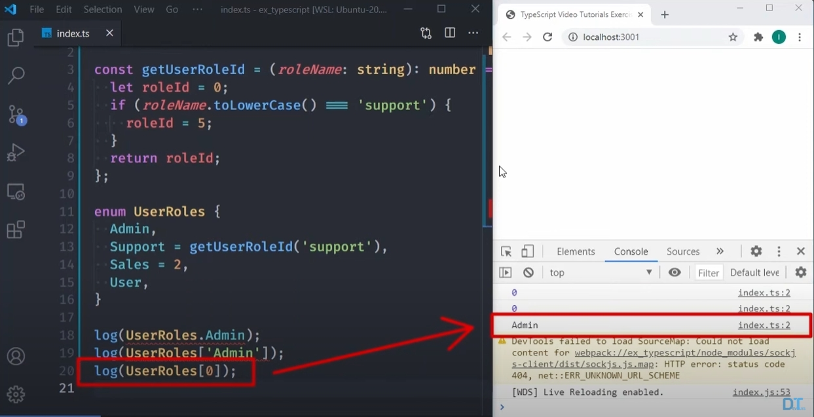
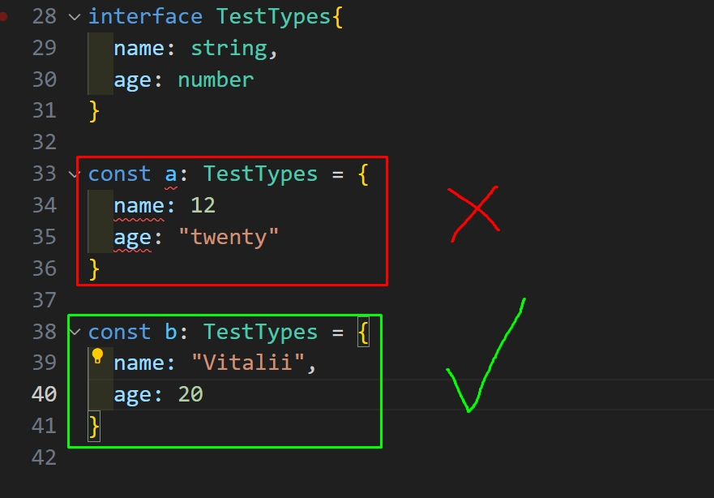

### Introduction to TypeScript

1. the TypeScript has `static types`, instead JavaScript has `dynamic types`
2. The types in TS are always written in a lower case
3. In TypeScript there are core types, such as: `any`, `number`, `string`, `boolean`, `object`, `Array<type> or [type1, type2] or any type`, `typle` - **different types of array (when we have an array, that includes a different values with different types)** for instance, and at the same time, it doesnt exist in JavaScript, `enum (enumarated list)` -  its like object and array that includes a constants, and at the same time, it doesnt exist in JavaScript

```tsx
//Array type
const arr:Array<number> = [2,6,8]
```

```tsx
// Typle example
const a = [2, "string"]
a: [number, string]
```
   **An Example with object typization in TS**

```tsx
const person: {
  name: string;
  age: number;
} = {
  name: "Vitalii",
  age: 20,
};
```

4. Nested object types
   Let's say you have this JavaScript object:

```tsx
const product = {
id: 'abc1',
price: 12.99,
tags: ['great-offer', 'hot-and-new'],
details: {
    title: 'Red Carpet',
    description: 'A great carpet - almost brand-new!'
}
}
```
This would be the type of such an object:

```tsx
const product: {
  id: string;
  price: number;
  tags: string[];
  details: {
    title: string;
    description: string;
  }
} = {
id: 'abc1',
price: 12.99,
tags: ['great-offer', 'hot-and-new'],
details: {
    title: 'Red Carpet',
    description: 'A great carpet - almost brand-new!'
}
}

```
So you have an object type in an object type so to say.

5. Enum in TS

---
Interface, if saying as simple, its own types, that uses in objects or classes.


6) Union types - for example (number | string)
7) To create own type, we need write next - `type TypeName = number;`, or union type, like - `type UnionTypeName = number | string`. And also own union type we can create for object itself, - `type UnionTypeName = {name: string, age: number}`
8) Function returns type - 
```ts
function sayHello(arg1: string, arg2: string): string{
    return ...
}
```
9) `unknown` type - when we store any values in one variable, we wont get any errors
10) `never` - it says, the `never` always represent a value, that wont ever happen